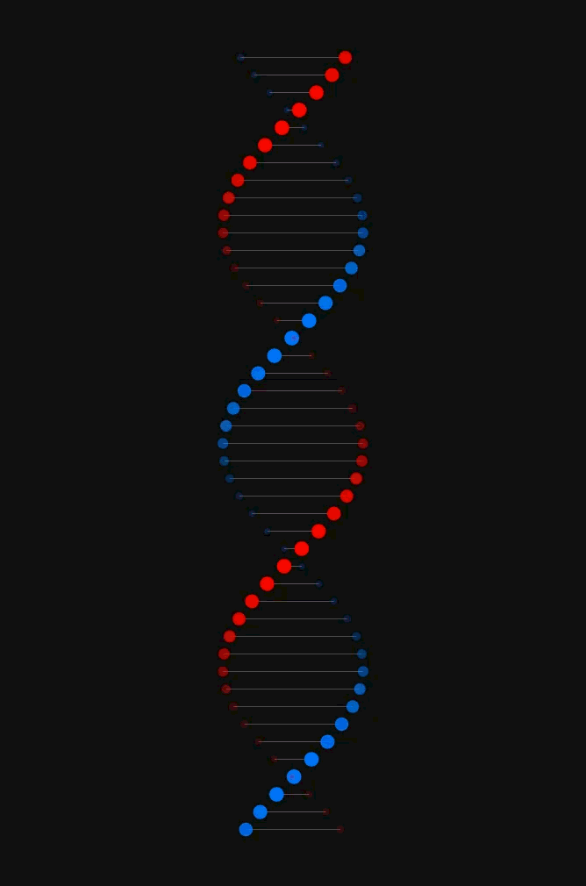

# 💊 Pharmagen



> **Pharmacogenetic Prediction and Therapeutic Efficacy via Deep Learning.**


**Pharmagen** is an advanced bioinformatics platform designed to predict patient phenotypic responses to specific drugs based on their genomic profile. It leverages deep learning models (**Deep Factorization Machines - DeepFM**) to analyze complex interactions between genetic variants (SNPs, haplotypes) and drug chemical structures.

The system integrates a comprehensive pipeline ranging from raw genomic file processing (VCF/FASTQ) to clinical prediction, offering robust support for decision-making in precision medicine.

---

## 🚀 Key Features

*   **Hybrid DeepFM Architecture:** Combines the memorization capability of low-order interactions with the generalization power of deep neural networks to model drug-gene relationships.
*   **Granular Clinical Outcomes:** Predicts specific pharmacological impacts (e.g., *"PK: Poor Metabolizer"*, *"Toxicity: High Risk"*), not just generic associations.
*   **Multi-Label Inference:** Capable of identifying multiple simultaneous effects (e.g., Low Efficacy AND Toxicity) for a single drug-variant pair.
*   **Integrated Bioinformatics Pipeline:** Tools for read cleaning (QC), alignment, and variant calling for Next-Generation Sequencing (NGS) data.
*   **Automated Optimization (AutoML):** Native integration with **Optuna** for efficient model hyperparameter search.
*   **Interactive Web Interface:** A modern **Streamlit** dashboard for single-patient and batch cohort analysis.

---

## 📋 System Requirements

*   **Operating System:** Linux (Recommended/Ubuntu), macOS, Windows (WSL2 recommended).
*   **Python:** Version **3.10** (Strict).
*   **Hardware:**
    *   CPU: Minimum 4 cores.
    *   RAM: 8GB (16GB+ recommended for training).
    *   GPU: NVIDIA CUDA-compatible (Optional, but highly recommended for training).

---

## 🛠️ Installation

We recommend using **uv** for ultra-fast dependency management, though `pip` and `conda` are also supported.

### Option A: Using `uv` (Recommended)

```bash
# 1. Install uv if not already installed
curl -LsSf https://astral.sh/uv/install.sh | sh

# 2. Clone the repository
git clone https://github.com/Aderfi/Pharmagen.git
cd Pharmagen

# 3. Sync environment (automatically creates venv and installs deps)
uv sync
```

### Option B: Using Standard `pip`

```bash
git clone https://github.com/Aderfi/Pharmagen.git
cd Pharmagen

# Create virtual environment
python3.10 -m venv venv
source venv/bin/activate  # On Windows: venv\Scripts\activate

# Install dependencies
pip install -e .
```

---

## 💻 Quick Usage Guide

To activate the environment with `uv`: `uv run python main.py [args]`
For standard environment: `python main.py [args]`

### 1. Interactive Mode (Menu)
Ideal for exploring functionalities without memorizing commands.

```bash
python main.py --mode menu
```

### 2. Data Preparation (ETL)
Generate the master training dataset from raw PharmGKB annotations.

```bash
uv run python src/data/etl_pipeline.py
```

### 3. Model Training
Train the model using the processed data.

```bash
# Standard training (Single Split)
python main.py --mode train --model Phenotype_Effect_Outcome --input data/processed/final_training_data.tsv

# Robust Validation (5-Fold Cross-Validation)
python main.py --mode train --model Phenotype_Effect_Outcome --input data/processed/final_training_data.tsv --cv 5
```

### 4. Launch Web Interface
Start the Streamlit dashboard to visualize predictions.

```bash
./run_app.sh
```

---

## 📂 Project Structure

For further details, see [docs/PROJECT_STRUCTURE.md](docs/PROJECT_STRUCTURE.md).

*   `src/`: Core source code (models, pipeline, CLI).
*   `config/`: TOML configuration files (paths, hyperparameters).
*   `data/`: Data storage (raw, processed, dicts).
*   `reports/`: Training outputs, plots, and Optuna reports.
*   `tests/`: Unit and integration tests.

---

## 🤝 Contributing

Contributions are welcome. Please open an *issue* to discuss major changes before submitting a *pull request*.

1.  Fork the project.
2.  Create your feature branch (`git checkout -b feature/AmazingFeature`).
3.  Commit your changes (`git commit -m 'Add some AmazingFeature'`).
4.  Push to the branch (`git push origin feature/AmazingFeature`).
5.  Open a Pull Request.

---

## 📄 License

This project is licensed under the **GNU GPLv3**. See the `LICENSE` file for more details.

---

**Author:** Adrim Hamed Outmani ([@Aderfi](https://github.com/Aderfi))
